```mermaid
flowchart TB
    subgraph BOUNDARY ["🔐  SIDEREAL AUTHORIZATION BOUNDARY  —  sidereal-system namespace"]
        direction TB

        subgraph CONTROLLER ["Controller Manager (Go / BoringCrypto)"]
            SCHED["Probe Scheduler"]
            RECONCILE["Result Reconciler"]
            EXPORT["Audit Export Pipeline"]
            BOOTSTRAP["Bootstrap Verifier"]
        end

        subgraph JOBS ["Probe Runner Jobs (Ephemeral — TTL-cleaned)"]
            RBAC_JOB["RBAC Probe Runner\n(Go)"]
            NETPOL_JOB["NetworkPolicy Probe Runner\n(Go)"]
            ADMISSION_JOB["Admission Control Probe Runner\n(Go)"]
            SECRET_JOB["Secret Access Probe Runner\n(Go)"]
            DETECT_JOB["Detection Coverage Probe Runner\n(Rust / aws-lc-rs FIPS)"]
        end

        subgraph CRDS ["Custom Resource Definitions"]
            GP["SiderealProbe\n(configuration)"]
            GPR["SiderealProbeResult\n(append-only audit log)"]
            GI["SiderealIncident\n(control failure record)"]
            GSA["SiderealSystemAlert\n(degraded state)"]
            GAO["SiderealAOAuthorization\n(detection probe authorization)"]
        end

        subgraph POLICIES ["Admission Enforcement Policies (Admission-layer controls)"]
            SIG_POLICY["sidereal-image-signature-required\n(cosign verification at admission)"]
            IMMUTABLE_POLICY["sidereal-proberesult-immutable\n(append-only enforcement)"]
            JOB_POLICY["sidereal-job-constraints\n(controller SA restriction)"]
            PVC_POLICY["sidereal-no-writable-pvc\n(non-persistence enforcement)"]
        end

        SCHED -->|"Creates Job with\nper-execution HMAC key"| JOBS
        RECONCILE -->|"Reads HMAC-signed\nresult ConfigMap"| JOBS
        RECONCILE -->|"Writes"| GPR
        RECONCILE -->|"Writes on failure"| GI
        RECONCILE -->|"Writes on degraded state"| GSA
        SCHED -->|"Reads"| GP
        SCHED -->|"Checks"| GAO
        EXPORT -->|"Reads"| GPR
    end

    subgraph EXTERNAL ["EXTERNAL SYSTEMS  —  Outside Authorization Boundary"]
        K8S["Kubernetes API Server"]
        ADMISSION_CTRL["Admission Controller\n(per profile)"]
        DET_BACKEND_A["Detection Backend\n(per profile)\n(gRPC API)"]
        DET_BACKEND_B["Detection Backend\n(per profile)\n(gRPC API)"]
        CNI_OBS_A["CNI Observability\n(per profile)"]
        CNI_OBS_B["CNI Observability\n(per profile)"]
        SPLUNK["Splunk HEC\n(SIEM)"]
        ELASTIC["Elasticsearch\n(SIEM)"]
        S3["Amazon S3\n(SSE-KMS / Object Lock)"]
    end

    CONTROLLER <-->|"mTLS · RBAC-scoped SA token\nTLS 1.2+ FIPS cipher suites"| K8S
    ADMISSION_CTRL -.->|"Enforces Job constraints\nat admission (inbound)"| CONTROLLER
    CONTROLLER -->|"detection backend gRPC\nmTLS · FIPS\nSAN-validated server cert"| DET_BACKEND_A
    CONTROLLER -->|"detection backend gRPC\nmTLS · FIPS\nSAN-validated server cert"| DET_BACKEND_B
    CONTROLLER -->|"CNI observability API\nmTLS · FIPS\nSAN-validated server cert"| CNI_OBS_A
    CONTROLLER -->|"CNI observability API\nmTLS · FIPS\nSAN-validated server cert"| CNI_OBS_B
    EXPORT -->|"TLS 1.2+ · HEC token\nFIPS cipher suites"| SPLUNK
    EXPORT -->|"TLS 1.2+ · API key\nFIPS cipher suites"| ELASTIC
    EXPORT -->|"TLS 1.2+ · SigV4\nSSE-KMS · Object Lock"| S3
```

# Authorization Boundary Diagram

**Purpose**: Defines the Sidereal authorization boundary for ATO package purposes.
Identifies all components inside the boundary, all external systems outside it,
and the security controls governing each boundary-crossing connection.

Per NIST 800-53 CA-3 and the Sidereal engineering specification, the deploying
agency must execute an Interconnection Security Agreement (ISA) for each
external connection listed in this diagram.

---

---

## Boundary Component Inventory

### Inside the Boundary

| Component | Type | Notes |
|---|---|---|
| Controller Manager | Kubernetes Deployment | Go binary; BoringCrypto FIPS; `sidereal-system` namespace |
| Probe Runner Jobs | Kubernetes Jobs (ephemeral) | Short-lived; TTL-cleaned; per-probe ServiceAccount |
| SiderealProbe CRDs | Kubernetes custom resources | Probe configuration; supports built-in and custom probe types |
| SiderealProbeResult CRDs | Kubernetes custom resources | Append-only audit records; impact-level-dependent TTL; multi-framework controlMappings |
| SiderealIncident CRDs | Kubernetes custom resources | Control failure records (enforce execution mode only) |
| SiderealSystemAlert CRDs | Kubernetes custom resources | Degraded state indicators |
| SiderealAOAuthorization CRDs | Kubernetes custom resources | Detection probe authorization |
| SiderealProbeRecommendation CRDs | Kubernetes custom resources | Discovery-generated probe suggestions |
| SiderealReport CRDs | Kubernetes custom resources | Optional scheduled report generation |
| Admission enforcement policies | Kubernetes custom resources | Admission-layer blast radius controls (per deployment profile) |
| `sidereal-system` NetworkPolicy | Kubernetes NetworkPolicy | Default-deny with explicit allow rules |
| HMAC root Secret | Kubernetes Secret | KMS-encrypted for IL4/IL5 |

### Outside the Boundary (External Systems)

| System | Connection Direction | Data Type | ISA Required |
|---|---|---|---|
| Kubernetes API Server | Bidirectional | Job creation; CRD read/write | No (same infrastructure) |
| Admission controller (e.g., Kyverno or OPA/Gatekeeper) | Inbound (enforces) | Admission decisions | No (same cluster) |
| Detection backend gRPC API (per deployment profile, e.g., Falco or Tetragon) | Inbound (read) | Alert/event records | Yes (if separate ownership) |
| CNI observability layer API (per deployment profile, e.g., Hubble or Calico) | Inbound (read) | Flow verdicts/records | Yes (if separate ownership) |
| Splunk HEC | Outbound (write) | Audit records | Yes |
| Elasticsearch | Outbound (write) | Audit records | Yes |
| S3 | Outbound (write) | Audit records | Yes |

*[Agency: Complete the ISA column with actual agreement references. For components
operated by the same agency under the same ATO boundary, ISA may not be required.]*

---

## Connection Security Controls Summary

| Connection | Authentication | Transport | Integrity |
|---|---|---|---|
| Controller → Kubernetes API | SA token (bound, 1hr max) | mTLS (cluster CA) | TLS record layer |
| Admission controller → Controller (webhook) | Kubernetes webhook mTLS | mTLS | TLS record layer |
| Controller → detection backends (e.g., Falco, Tetragon) | mTLS client cert / SPIFFE SVID | gRPC/TLS 1.2+ FIPS | TLS + gRPC framing |
| Controller → CNI observability backends (e.g., Hubble, Calico) | mTLS client cert / SPIFFE SVID | REST/TLS 1.2+ FIPS | TLS record layer |
| Controller → Splunk/Elasticsearch | API key over TLS | HTTPS TLS 1.2+ FIPS | TLS + HMAC payload signing |
| Controller → S3 | AWS SigV4 | HTTPS TLS 1.2+ | TLS + SigV4 + SSE-KMS |
