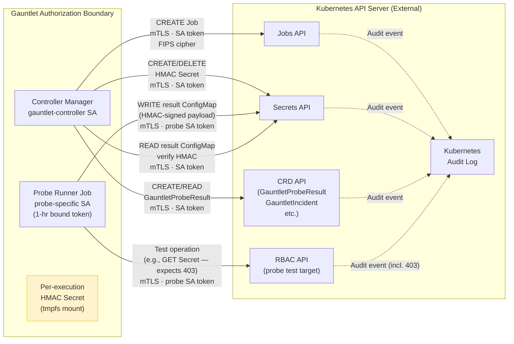
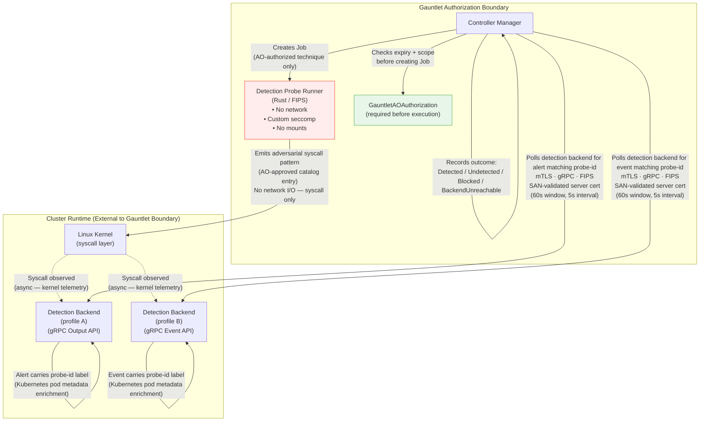
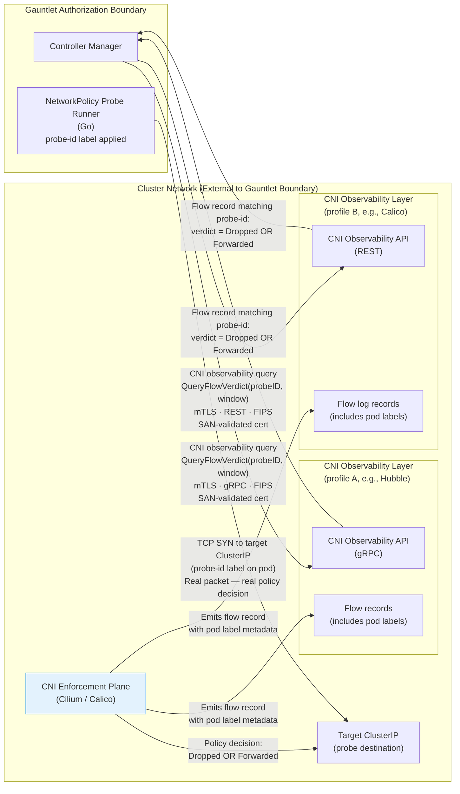
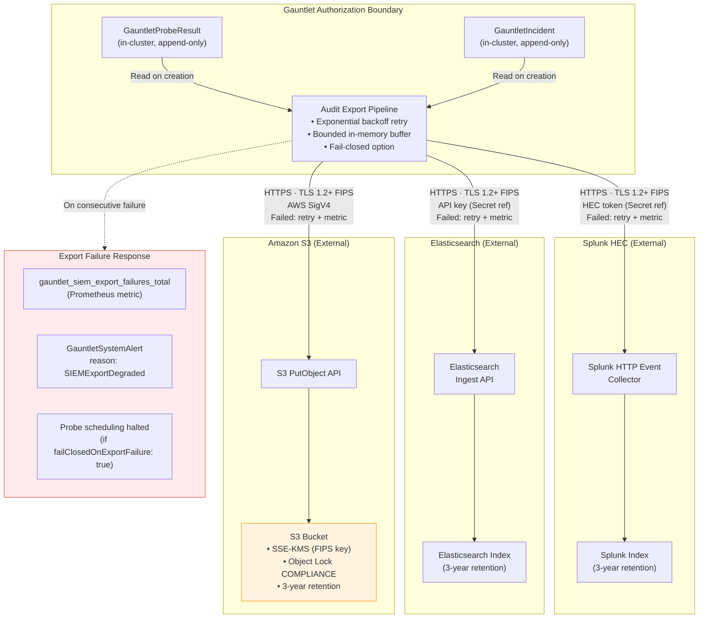

# Data Flow Diagrams

**Purpose**: Documents the data flows between Gauntlet and each external system.
Each diagram shows what data flows, in which direction, and what security controls
protect the flow. Required for ATO boundary analysis and ISA/MOU documentation.

---

## DF-1: Probe Execution → Kubernetes API Server

The most frequent data flow. Every probe runner communicates exclusively with
the Kubernetes API server to execute its probe action and write its result.

**Data flowing across boundary:**

| Flow | Data | Direction | Protection |
|---|---|---|---|
| Job creation | Job spec (SA reference, HMAC Secret ref, labels) | Outbound | mTLS, RBAC |
| Probe test operation | API request (verb, resource, namespace) | Outbound | mTLS, probe SA token (1hr) |
| Result ConfigMap write | HMAC-signed probe result payload | Outbound | mTLS, HMAC |
| GauntletProbeResult create | Structured audit record | Outbound | mTLS, admission enforcement append-only |
| Kubernetes audit log | All API operations | Internal to K8s | K8s audit log controls |

---

## DF-2: Detection Probe → Detection Backends (e.g., Falco, Tetragon)

The most security-sensitive data flow. Two separate actions by two separate
identities — the probe emits a syscall pattern; the controller independently
queries whether it was detected.

**Key design property**: The detection probe runner has **no network access**.
It cannot communicate with the detection backends or the controller. The controller
independently queries the detection backends (e.g., Falco, Tetragon) after the probe completes —
two separate identities, two separate actions, independent of each other.

**Data flowing across boundary:**

| Flow | Data | Direction | Protection |
|---|---|---|---|
| Detection backend query (e.g., Falco) | `QueryAlerts(probeID, window)` gRPC call | Outbound | mTLS, SAN validation, FIPS |
| Detection backend response (e.g., Falco) | Alert records with pod metadata | Inbound | mTLS, TLS record layer |
| Detection backend query (e.g., Tetragon) | `GetEventsStream(probeID, window)` gRPC call | Outbound | mTLS, SAN validation, FIPS |
| Detection backend response (e.g., Tetragon) | Event records with pod metadata | Inbound | mTLS, TLS record layer |

**Outcomes and responses:**

| Outcome | Meaning | GauntletIncident? |
|---|---|---|
| `Detected` | Alert raised within 60s window | No (pass) |
| `Undetected` | No alert within 60s window | Yes — detection gap |
| `Blocked` | Syscall blocked by detection backend enforcement mode (e.g., Tetragon) | No (pass — enforcement active) |
| `BackendUnreachable` | gRPC query failed | GauntletSystemAlert |

---

## DF-3: NetworkPolicy Probe → CNI Observability Backends (e.g., Hubble, Calico)

The NetworkPolicy probe reads enforcement verdicts directly from the CNI
observability layer — the authoritative source of what the enforcement plane
decided — rather than inferring from TCP behavior.

**Why CNI verdict, not TCP response:**
Reading from the CNI observability API eliminates false negatives from
application-layer responses. A TCP RST from the destination could indicate
either a NetworkPolicy drop or an application rejection — ambiguous. The
CNI flow verdict is unambiguous: it is the enforcement decision.

**Data flowing across boundary:**

| Flow | Data | Direction | Protection |
|---|---|---|---|
| CNI observability flow verdict query (e.g., Hubble) | `GetFlows(filter: probe-id label)` gRPC | Outbound | mTLS, SAN validation, FIPS |
| CNI observability flow verdict response (e.g., Hubble) | Flow records (src, dst, protocol, verdict, pod labels) | Inbound | mTLS, TLS record layer |
| CNI observability flow verdict query (e.g., Calico) | REST query (filter: probe-id label) | Outbound | mTLS, SAN validation, FIPS |
| CNI observability flow verdict response (e.g., Calico) | Flow log entries (src, dst, protocol, action, labels) | Inbound | mTLS, TLS record layer |

---

## DF-4: Audit Export → SIEM Targets

All `GauntletProbeResult` and `GauntletIncident` records are exported to
the configured SIEM immediately on creation. SIEM export is a first-class
feature — it is not optional for federal deployments.

**Audit record fields exported to SIEM:**

| Field | Value | Purpose |
|---|---|---|
| `probe.type` | `rbac`, `netpol`, `admission`, `secret`, `detection` | Filter by control surface |
| `result.outcome` | `Pass`, `Fail`, `Undetected`, etc. | Gap identification |
| `execution.timestamp` | RFC 3339 UTC, nanosecond precision | Timeline reconstruction |
| `result.nistControls` | `["AC-3", "AC-6"]` etc. | Control-specific reporting |
| `result.integrityStatus` | `Verified` / `TamperedResult` | Integrity assurance |
| `probe.targetNamespace` | `production` (or redacted ID) | Scope identification |
| `probe.id` | UUID | Correlation key |
| `audit.exportStatus` | `Exported` / `Pending` / `Failed` | Delivery confirmation |

**Data flowing across boundary:**

| Flow | Data | Direction | Protection |
|---|---|---|---|
| Probe result export (Splunk) | Structured JSON audit record | Outbound | TLS 1.2+ FIPS, HEC token |
| Probe result export (Elasticsearch) | Structured JSON audit record | Outbound | TLS 1.2+ FIPS, API key |
| Probe result export (S3) | Structured JSON audit record | Outbound | TLS 1.2+ FIPS, SigV4, SSE-KMS |
| Export acknowledgment | Delivery confirmation (token / `_id` / ETag) | Inbound | TLS record layer |

---

## Summary — All Data Flows

| Flow ID | Source | Destination | Data Classification | ISA Required |
|---|---|---|---|---|
| DF-1 | Controller / Probe Jobs | Kubernetes API | System operations + audit | No (same infrastructure) |
| DF-2 | Controller | Detection backends (e.g., Falco, Tetragon) | Detection query (no PII) | Yes (if separate org) |
| DF-3 | Controller | CNI observability backends (e.g., Hubble, Calico) | Flow verdict query (no PII) | Yes (if separate org) |
| DF-4 | Controller | Splunk / Elasticsearch / S3 | Audit records (potentially PII — see PIA) | Yes |

*[Agency: Complete the ISA Required column with actual agreement references.]*
