# Network Diagram — gauntlet-system Namespace Topology

**Purpose**: Documents the network topology of the `gauntlet-system` namespace,
the NetworkPolicy rules that enforce the default-deny boundary, and the explicit
egress paths permitted for each Gauntlet component. This diagram supports SC-7
boundary protection documentation and is the reference topology tested by
Gauntlet's own NetworkPolicy probe surface.

---

## Namespace Network Topology

```mermaid
flowchart TB
    subgraph CLUSTER ["Kubernetes Cluster Network"]

        subgraph GAUNTLET_NS ["gauntlet-system namespace\n[NetworkPolicy: default-deny ingress + egress]"]
            direction TB

            subgraph CTRL_POD ["Controller Manager Pod"]
                CTRL_PROC["gauntlet-controller\nprocess\n:8080 metrics\n:8081 health"]
            end

            subgraph JOB_PODS ["Probe Runner Job Pods (ephemeral)"]
                J_RBAC["RBAC\nJob Pod"]
                J_NET["NetPol\nJob Pod"]
                J_ADM["Admission\nJob Pod"]
                J_SEC["Secret\nJob Pod"]
                J_DET["Detection\nJob Pod\n[isolated network\nnamespace]"]
            end
        end

        subgraph KUBE_SYSTEM ["kube-system namespace"]
            KUBE_API["Kubernetes API Server\n:443"]
            ADMISSION_POD["Admission Controller\nwebhook\n:443"]
        end

        subgraph MONITORING_NS ["monitoring namespace (or cluster-scoped)"]
            PROMETHEUS["Prometheus\nscraper"]
            DET_BACKEND_A["Detection Backend\n(per profile)\n:gRPC"]
            DET_BACKEND_B["Detection Backend\n(per profile)\n:gRPC"]
        end

        subgraph CNI_NS ["CNI Observability namespace\n(per profile)"]
            CNI_OBS_A["CNI Observability\nRelay\n(per profile)"]
            CNI_OBS_B["CNI Observability\nAPI Service\n(per profile)"]
        end
    end

    subgraph EXTERNAL ["External Network (outside cluster)"]
        SPLUNK_EXT["Splunk HEC\n:443"]
        ELASTIC_EXT["Elasticsearch\n:9200 or :443"]
        S3_EXT["Amazon S3\n:443"]
        NTP_EXT["NTP Server\n:123 UDP"]
    end

    %% Controller ingress
    ADMISSION_POD -->|"PERMITTED INGRESS\nadmission controller webhook callback :8443\n(TLS)"| CTRL_POD
    PROMETHEUS -->|"PERMITTED INGRESS\nmetrics scrape :8080\n(ClusterIP only)"| CTRL_POD

    %% Controller egress to cluster
    CTRL_POD -->|"PERMITTED EGRESS\nK8s API :443\nmTLS"| KUBE_API
    CTRL_POD -->|"PERMITTED EGRESS\ndetection backend gRPC\n(per profile port)\nmTLS"| DET_BACKEND_A
    CTRL_POD -->|"PERMITTED EGRESS\ndetection backend gRPC\n(per profile port)\nmTLS"| DET_BACKEND_B
    CTRL_POD -->|"PERMITTED EGRESS\nCNI observability\n(per profile port)\nmTLS"| CNI_OBS_A
    CTRL_POD -->|"PERMITTED EGRESS\nCNI observability API\n(per profile port)\nmTLS"| CNI_OBS_B

    %% Controller egress to external
    CTRL_POD -->|"PERMITTED EGRESS\nSplunk HEC :443\nTLS 1.2+ FIPS"| SPLUNK_EXT
    CTRL_POD -->|"PERMITTED EGRESS\nElasticsearch :443/:9200\nTLS 1.2+ FIPS"| ELASTIC_EXT
    CTRL_POD -->|"PERMITTED EGRESS\nS3 :443\nTLS 1.2+ FIPS"| S3_EXT

    %% Probe runner egress (K8s API only)
    J_RBAC -->|"PERMITTED EGRESS\nK8s API :443\nmTLS"| KUBE_API
    J_NET -->|"PERMITTED EGRESS\nK8s API :443 + probe target\nmTLS"| KUBE_API
    J_ADM -->|"PERMITTED EGRESS\nK8s API :443\nmTLS"| KUBE_API
    J_SEC -->|"PERMITTED EGRESS\nK8s API :443\nmTLS"| KUBE_API

    %% Detection probe — no network
    J_DET -.-x|"BLOCKED — isolated\nnetwork namespace\nNo egress permitted"| KUBE_API

    %% Node NTP (infrastructure level)
    CLUSTER -.->|"Node-level NTP\n:123 UDP\n(infrastructure control)"| NTP_EXT

    style J_DET fill:#ffecec,stroke:#f44336
    style GAUNTLET_NS fill:#e8f5e9,stroke:#4CAF50,stroke-width:3px
```



---

## NetworkPolicy Specification

The following NetworkPolicy rules are deployed by the Gauntlet Helm chart
for the `gauntlet-system` namespace. This is the reference policy that the
NetworkPolicy probe surface continuously validates is being enforced.

### Ingress Rules

```yaml
# Applied to: all pods in gauntlet-system namespace
# Default: DENY ALL ingress not matched below
ingress:
  - description: "Admission controller webhook callbacks to controller (e.g., Kyverno)"
    from:
      - namespaceSelector:
          matchLabels:
            kubernetes.io/metadata.name: kube-system
    ports:
      - protocol: TCP
        port: 8443

  - description: "Prometheus metrics scrape"
    from:
      - namespaceSelector:
          matchLabels:
            kubernetes.io/metadata.name: monitoring
        podSelector:
          matchLabels:
            app: prometheus
    ports:
      - protocol: TCP
        port: 8080
```

### Egress Rules — Controller Manager

```yaml
# Applied to: pods with label app=gauntlet-controller
# Default: DENY ALL egress not matched below
egress:
  - description: "Kubernetes API Server"
    to:
      - ipBlock:
          cidr: <API_SERVER_CIDR>    # [Agency: set in values-override.yaml]
    ports:
      - protocol: TCP
        port: 443

  - description: "Detection backend gRPC (per deployment profile, e.g., Falco or Tetragon)"
    to:
      - namespaceSelector:
          matchLabels:
            kubernetes.io/metadata.name: <DETECTION_BACKEND_NAMESPACE>  # [Agency: per deployment profile]
        podSelector:
          matchLabels:
            app: <DETECTION_BACKEND_APP_LABEL>  # [Agency: per deployment profile]
    ports:
      - protocol: TCP
        port: <DETECTION_BACKEND_PORT>  # [Agency: per deployment profile, e.g., 50051 for Falco, 54321 for Tetragon]

  - description: "CNI observability layer (per deployment profile, e.g., Hubble Relay or Calico API)"
    to:
      - namespaceSelector:
          matchLabels:
            kubernetes.io/metadata.name: <CNI_OBSERVABILITY_NAMESPACE>  # [Agency: per deployment profile]
        podSelector:
          matchLabels:
            app: <CNI_OBSERVABILITY_APP_LABEL>  # [Agency: per deployment profile]
    ports:
      - protocol: TCP
        port: <CNI_OBSERVABILITY_PORT>  # [Agency: per deployment profile, e.g., 4245 for Hubble, 5443 for Calico]

  - description: "SIEM export endpoints (agency-configured)"
    to:
      - ipBlock:
          cidr: <SIEM_ENDPOINT_CIDR>  # [Agency: set in values-override.yaml]
    ports:
      - protocol: TCP
        port: 443
```

### Egress Rules — Probe Runner Jobs

```yaml
# Applied to: pods with label gauntlet.io/probe-type=rbac|netpol|admission|secret
# Default: DENY ALL egress not matched below
egress:
  - description: "Kubernetes API Server (all probe types)"
    to:
      - ipBlock:
          cidr: <API_SERVER_CIDR>
    ports:
      - protocol: TCP
        port: 443

  - description: "Probe target namespace (NetworkPolicy probe only)"
    # Added dynamically by controller for netpol probe Jobs
    # Scoped to specific target ClusterIP for the probe's test path
```

### Detection Probe — Network Isolation

```yaml
# Applied to: pods with label gauntlet.io/probe-type=detection
# No egress rules — detection probe pods have NO network egress permitted
# The pod runs in an isolated network namespace
egress: []   # empty — deny all
```

---

## Port and Protocol Summary

| Component | Port | Protocol | Direction | Purpose |
|---|---|---|---|---|
| Controller | 8080 | TCP | Ingress | Prometheus metrics scrape |
| Controller | 8081 | TCP | Ingress | Liveness / readiness probes |
| Controller | 8443 | TCP | Ingress | Admission controller webhook callbacks |
| Controller | 443 | TCP | Egress | Kubernetes API Server |
| Controller | Per profile | TCP | Egress | Detection backend gRPC (e.g., Falco :50051, Tetragon :54321) |
| Controller | Per profile | TCP | Egress | CNI observability layer (e.g., Hubble Relay :4245, Calico :5443) |
| Controller | 443 or 9200 | TCP | Egress | SIEM export (Splunk/Elasticsearch/S3) |
| Probe runners (non-detection) | 443 | TCP | Egress | Kubernetes API Server only |
| Detection probe | — | — | None | Isolated — no network |

*No ports below 1024 are opened by Gauntlet components. No UDP services.
No LoadBalancer or NodePort Services are created by the Helm chart.*

---

## Topology Validation

This network topology is continuously validated by Gauntlet's own NetworkPolicy
probe surface. The probe tests:

1. `gauntlet-system` → external internet (non-SIEM): **must be DROPPED**
2. `gauntlet-system` → kube-system (non-API paths): **must be DROPPED**
3. Other namespaces → `gauntlet-system` (non-permitted ingress): **must be DROPPED**
4. `gauntlet-system` → SIEM endpoint on port 443: **must be FORWARDED**
5. `gauntlet-system` → detection backend namespace on configured port: **must be FORWARDED**

A `Forwarded` verdict on tests 1–3 or a `Dropped` verdict on tests 4–5
generates a `GauntletIncident` CR documenting the enforcement gap.

*[Agency: Configure `GauntletProbe` resources to test the specific flow paths
relevant to your deployment topology, using the above as a reference set.]*
