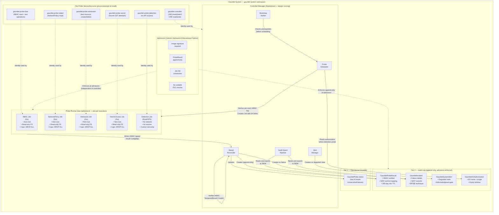
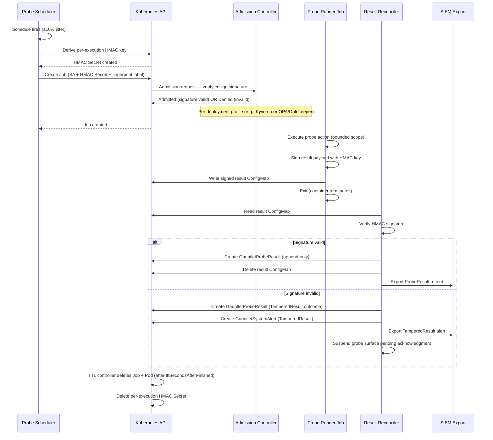
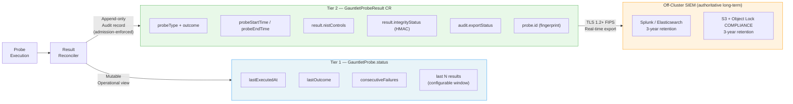

# System Architecture Diagram

**Purpose**: Illustrates the internal architecture of the Gauntlet operator —
component relationships, probe execution lifecycle, result storage tiers, and
the separation of identity between the controller and probe runners.

---

## Component Architecture

---

## Probe Execution Lifecycle

---

## Two-Tier Result Storage

---

## Role and Identity Separation

The following table documents the explicit separation between controller
and probe runner identities — a critical design property for AC-3, AC-6,
and CA-2 independence requirements.

| Identity | Can Do | Cannot Do |
|---|---|---|
| `gauntlet-controller` SA | Create Jobs; read/write CRDs; read HMAC Secret | Perform any probe operation; access target namespace resources |
| `gauntlet-probe-rbac` SA | RBAC test operations in target namespace | Access other namespaces; modify any resource |
| `gauntlet-probe-netpol` SA | Read NetworkPolicy objects | Any write; cross-namespace access |
| `gauntlet-probe-admission` SA | Create/delete test resources (specific types) | Access Secrets; persistent resource creation |
| `gauntlet-probe-secret` SA | Attempt GET on test Secret names | Write Secrets; cross-namespace read (expects 403) |
| `gauntlet-probe-detection` SA | None — no Kubernetes API access | Any Kubernetes API operation |

**Key property**: The controller cannot perform the operations the probes
perform. A compromised controller cannot produce a falsified probe result
through direct API access — it would need to compromise a probe runner Job
AND defeat HMAC verification.
